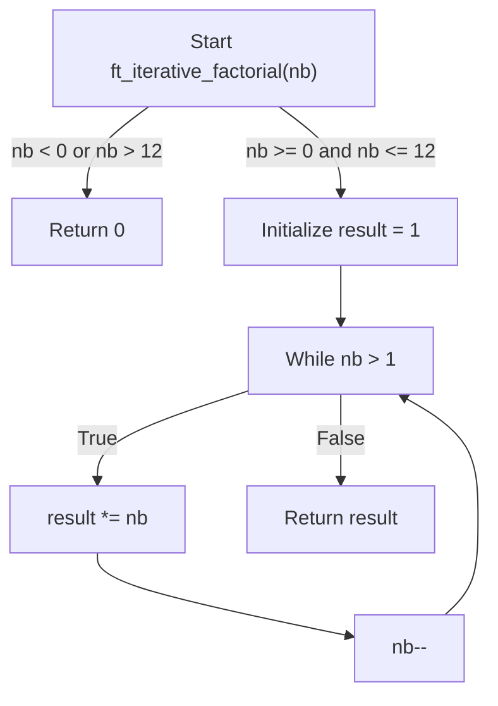

# Exercise with example


```c
/*
#include <stdio.h>
#include <stdlib.h> // for atoi
*/

int	ft_iterative_factorial(int nb)
{
	int	result;

	result = 1;
	if (nb < 0 || nb > 12)
		return (0);
	while (nb > 1)
	{
		result *= nb;
		nb--;
	}
	return (result);
}
/*
int main(int argc, char *argv[])
{
    int number, factorial;

    if (argc != 2) {
        fprintf(stderr, "Usage: %s <number>\n", argv[0]); // Print usage message
        return (1); // Indicate error
    }

    number = atoi(argv[1]); // Convert string argument to integer

    if (number < 0) {
        printf("Factorial is not defined for negative numbers.\n");
        return (1); // Indicate error
    }

    factorial = ft_iterative_factorial(number);

    printf("The factorial of %d is %d\n", number, factorial);

    return (0); // Indicate successful execution
}
*/
```
