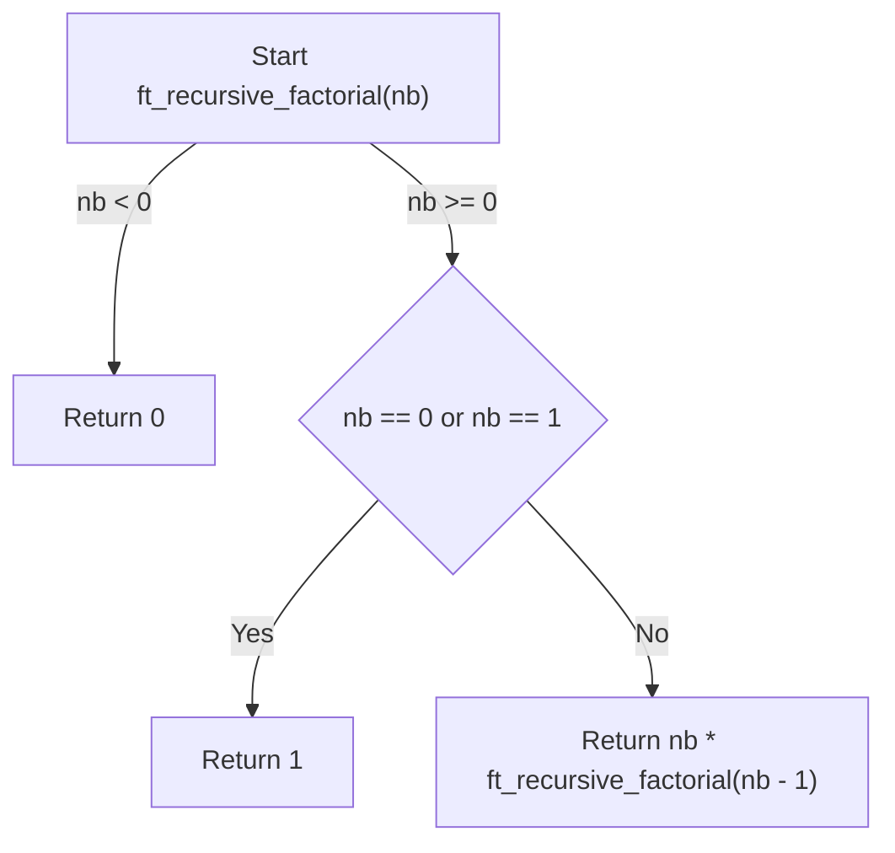

```mermaid
graph TD;
    A["Start ft_recursive_factorial(nb)"] -->|nb < 0| B["Return 0"];
    A -->|nb >= 0| C{"nb == 0 or nb == 1"};
    C -->|Yes| D["Return 1"];
    C -->|No| E["Return nb * ft_recursive_factorial(nb - 1)"];
```
