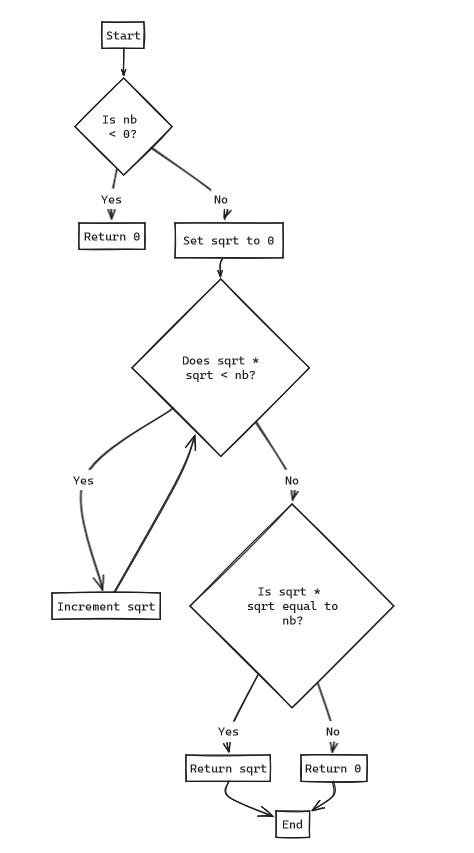

# ft_sqrt.c
This code gives us a number (let's call it A), and we have to find the number (let's call it B) that, when multiplied by itself, equals A. So, what we do is start from 0 and keep multiplying this value (let's call it B) by itself. If the result of the multiplication is less than A, we increment B. If there comes a point where the condition is no longer met (i.e., B * B < A), there are only two cases left: either B is eventually the square root of A or a greater number. Therefore, we use a conditional to check if our multiplication yields A. If it doesn't, it means we've surpassed A, so it returns 0. If it does, it means B is the square root of A.

```c
int ft_sqrt(int nb)
{
    int sqrt;

    if (nb < 0)
        return (0);
    sqrt = 0;
    while (sqrt * sqrt < nb)
        sqrt++;
    if (sqrt * sqrt == nb)
        return (sqrt);
    return (0);
}
```

