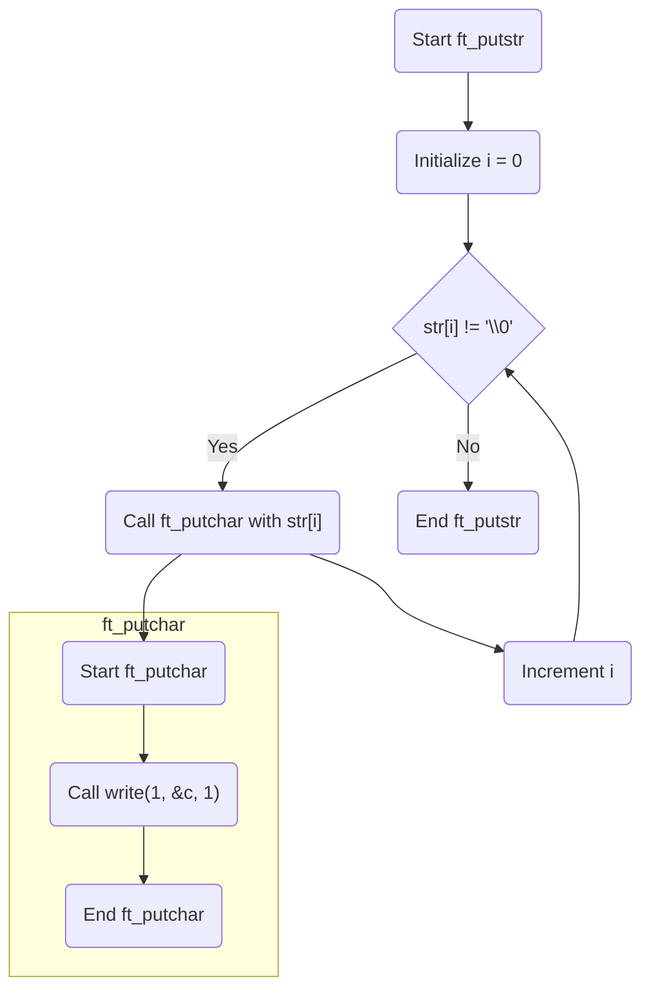

```mermaid
flowchart TD
    A("Start ft_putstr") --> B("Initialize i = 0")
    B --> C{"str[i] != '\\0'"}
    C -->|Yes| D("Call ft_putchar with str[i]")
    D --> E("Increment i")
    E --> C
    C -->|No| F("End ft_putstr")

    subgraph ft_putchar
        D1("Start ft_putchar") --> D2("Call write(1, &c, 1)")
        D2 --> D3("End ft_putchar")
    end

    D --> D1
```
