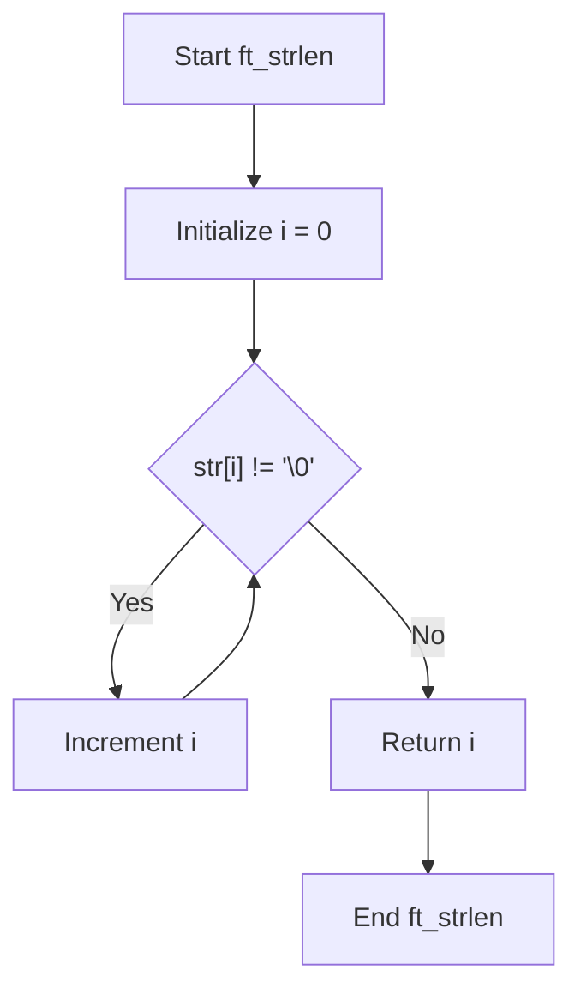

```mermaid
flowchart TD
    A["Start ft_strlen"] --> B["Initialize i = 0"]
    B --> C{"str[i] != '\0'"}
    C -->|Yes| D["Increment i"]
    D --> C
    C -->|No| E["Return i"]
    E --> F["End ft_strlen"]
```
