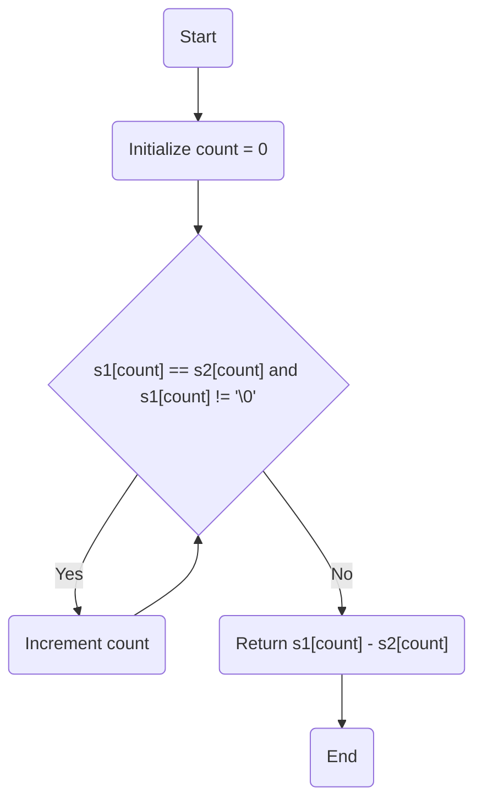

```mermaid
flowchart TD
    A("Start") --> B("Initialize count = 0")
    B --> C{"s1[count] == s2[count] and s1[count] != '\0'"}
    C -->|Yes| D("Increment count")
    D --> C
    C -->|No| E("Return s1[count] - s2[count]")
    E --> F("End")
```
