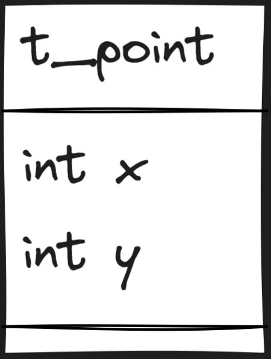
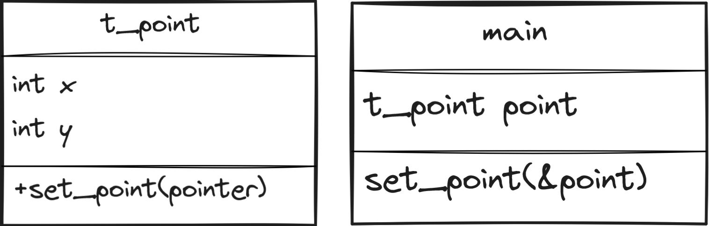

# ft_point.h
Create a file ft_point.h that'll compile the following main:
```c
#include "ft_point.h"

void  set_point(t_point *point)
{
point->x = 42;
point->y = 21;
}

int main(void)
{
  t_point point;
  set_point(&point);
  return (0);
}
```
We have to **define a structure t_point** with **x** and **y** as its **members**:
```c
#ifndef FT_POINT_H
#define FT_POINT_H

typedef struct s_point
{
  int x;
  int y;
} t_point;

#endif
```
> [!TIP]
> If you don't understand this, see if reading [SIMPLE](SIMPLE.md) helps you understand it better.
## Explanation:
```c
#ifndef FT_POINT_H
```
This line checks if the preprocessor macro FT_POINT_H is not defined. The #ifndef directive stands for "if not defined". 
This is the first part of an include guard, which prevents the code within the guard from being included more than once in a single compilation.
(We are checking if we have not defined FT_POINT_H before. If we haven't, we will do some stuff next.)
```c
#define FT_POINT_H
```
If FT_POINT_H is not defined, this line defines it. 
The purpose of this is to ensure that the following code is only included once, even if this header file is included multiple times in different files.
(We now define FT_POINT_H so that next time we know we have already done this and won't do it again.)
```c
typedef struct s_point
{
  int x;
  int y;
} t_point;
```
- `typedef` is a keyword used to create an alias for a data type, making it easier to use. (lets us make a nickname for a type.)
- `struct s_point` defines a structure with the tag s_point. A structure in C is a user-defined data type that groups related variables.
- `{ int x; int y; }` are the members of the structure. Here, `x` and `y` are both integers that represent coordinates in a 2D space.
- `t_point` is the alias name for the structure struct s_point. This means you can use t_point instead of struct s_point when declaring variables of this type, making the code cleaner and easier to read. (We call this group t_point so we can use this shorter name instead of the longer struct s_point.)
```c
#endif
```
This line ends the conditional started by #ifndef. If the file has not been included before, the code between #ifndef and #endif is included. If it has been included before, it is ignored.
(This ends our check. If we haven't added this file before, we do it now. If we already did it, we skip everything between #ifndef and #endif.)

Sure, here's how you can represent that in a table format:

| Name      | File Image            |
|-----------|-----------------------|
| ft_point.h|  |
| main.c    |  |
