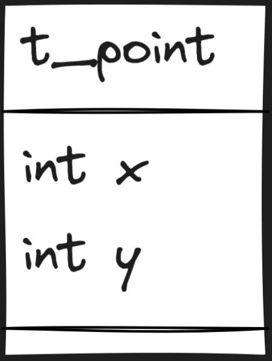

### What's Happening?

1. **Create a Special File**:
   - You need a file called `ft_point.h`.

2. **Add Some Important Stuff**:
   - This file will help your program understand what a `t_point` is. Think of `t_point` like a special box that can hold two numbers, `x` and `y`.

3. **Magic Code Explanation**:
   - **`#ifndef FT_POINT_H`**: This checks if we have not already included this special file.
   - **`#define FT_POINT_H`**: If we haven't included it, this line says "let's include it now".
   - **`typedef struct s_point`**: We are creating a new special box called `s_point` that holds two numbers, `x` and `y`.
   - **`int x; int y;`**: These are the two numbers inside the box.
   - **`} t_point;`**: Now, we give our special box a nickname: `t_point`.
   - **`#endif`**: This ends our check. If we already included the file before, we skip everything between `#ifndef` and `#endif`.

### What to Put in the File:
Your `ft_point.h` file should look like this:

```c
#ifndef FT_POINT_H
#define FT_POINT_H

typedef struct s_point
{
  int x;
  int y;
} t_point;

#endif
```

### What It Does:
1. **Check and Include**: It checks if the file has been included before and includes it if not.
2. **Create a Box**: It makes a special box (`t_point`) to hold two numbers (`x` and `y`).

### Main Program:
In your main program:

```c
#include "ft_point.h"

void set_point(t_point *point)
{
  point->x = 42;
  point->y = 21;
}

int main(void)
{
  t_point point;
  set_point(&point);
  return (0);
}
```

This program will:
1. **Use the Special Box**: Include the file that defines the special box `t_point`.
2. **Set Values**: Put the numbers `42` and `21` into `x` and `y` of the special box.
3. **Run the Program**: Create a `point` and set its `x` and `y` values using the `set_point` function.

That's it! Now you have a file that helps your program understand and use a special box called `t_point` to store two numbers.

| Name      | File Image            |
|-----------|-----------------------|
| **[ft_point.h](ft_point.h)**|  |
| **[main.c](main.c)**    |  |

