# Parte 1 - libc Functions

### isalpha
**checks  for an alphabetic character; in the standard "C" locale, it is equivalent to (isupper(c) || is‐lower(c)). 
In some locales, there may be additional characters for  which  isalpha()  is  true—letters which are neither uppercase nor lowercase.**

`int ft_isalpha(int c);`

The values returned are nonzero if the character c falls into the tested class, and zero if not.

```c
int	ft_isalpha(int c)
{
	if ((c >= 'a' && c <= 'z') || (c >= 'A' && c <= 'Z'))
		return (1);
	return (0);
}
```

The function checks if the character falls within either of the following ranges:
* From 'a' to 'z' (ASCII values of lowercase letters).
* From 'A' to 'Z' (ASCII values of uppercase letters).

If the character falls within either of these ranges, the function returns 1, indicating it's alphabetic. Otherwise, it returns 0.

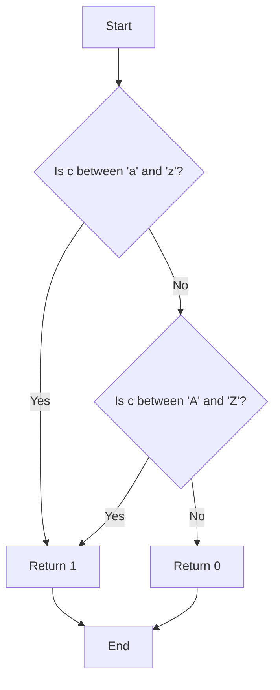
### isdigit
**checks for a digit (0 through 9).**

`int ft_isdigit(int c);`

The values returned are nonzero if the character c falls into the tested class, and zero if not.

```c
int	ft_isdigit(int c)
{
	if (c >= 48 && c <= 57)
		return (1);
	return (0);
}
```

This ft_isdigit function is designed to check whether a character is a digit. It checks if the character falls within the ASCII range corresponding to digits, which is from '0' to '9' (ASCII values 48 to 57).

If the character falls within this range, the function returns 1, indicating it's a digit. Otherwise, it returns 0.

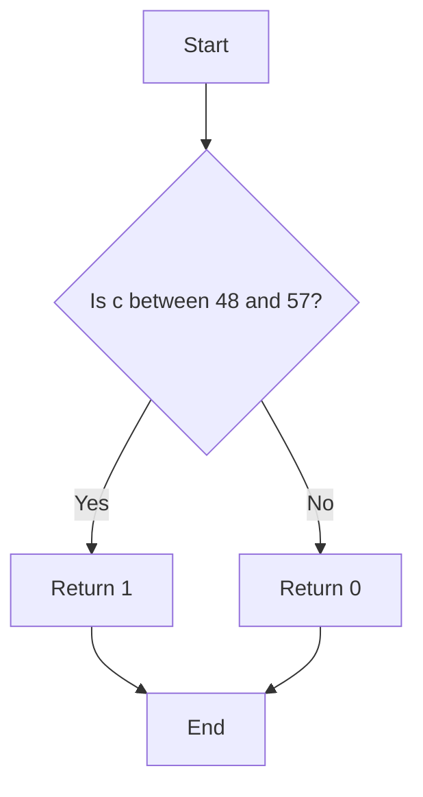
### isalnum
**checks for an alphanumeric character; it is equivalent to (isalpha(c) || isdigit(c)).**

`int ft_isalnum(int c);`

The values returned are nonzero if the character c falls into the tested class, and zero if not.

```c
int	ft_isalnum(char c)
{
	if ((c >= 48 && c <= 57)
		|| (c >= 65 && c <= 90)
		|| (c >= 97 && c <= 122))
		return (1);
	return (0);
}
```
The function checks if the character falls within any of the following ranges:
* From '0' to '9' (ASCII values 48 to 57), representing numeric digits.
* From 'A' to 'Z' (ASCII values 65 to 90), representing uppercase letters.
* From 'a' to 'z' (ASCII values 97 to 122), representing lowercase letters.

If the character falls within any of these ranges, the function returns 1, indicating it's alphanumeric. Otherwise, it returns 0.

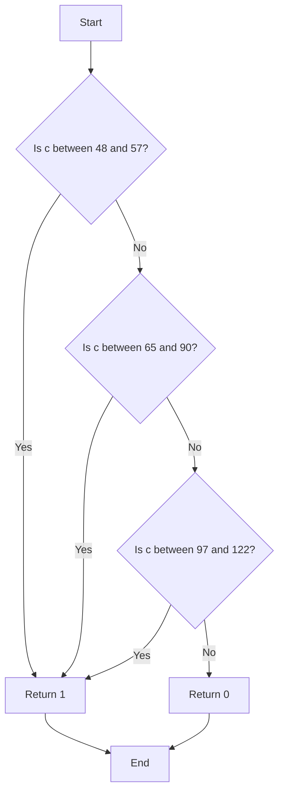
### isascii
**checks whether c is a 7-bit unsigned char value that fits into the ASCII character set.**

`int ft_isascii(int c);`

The values returned are nonzero if the character c falls into the tested class, and zero if not.

```c
int	ft_isascii(int c)
{
	if (c >= 0 && c <= 127)
		return (1);
	return (0);
}
```
This ft_isascii function is designed to check whether a character is a valid ASCII character. It verifies if the character's ASCII value falls within the range of 0 to 127, inclusive, which covers all standard ASCII characters.

If the character's ASCII value falls within this range, the function returns 1, indicating it's a valid ASCII character. Otherwise, it returns 0.
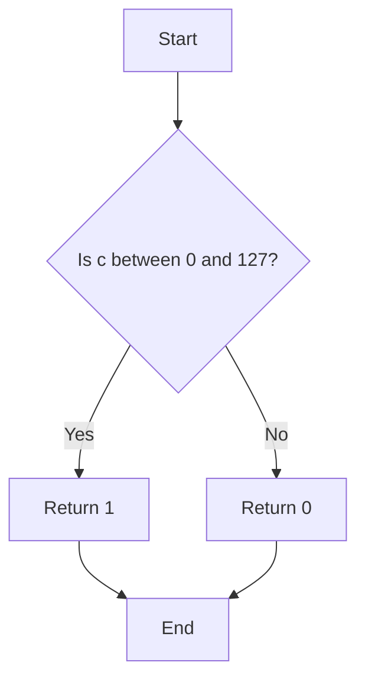
### isprint
**checks for any printable character including space.**

`int ft_isprint(int c);`

The values returned are nonzero if the character c falls into the tested class, and zero if not.

```c
int	ft_isprint(int c)
{
	if (c >= 32 && c <= 127)
		return (1);
	return (0);
}
```
This ft_isprint function is designed to check whether a character is a printable character. It checks if the character's ASCII value falls within the range of 32 to 127, inclusive. In ASCII, this range covers all printable characters, including letters, digits, punctuation marks, and some special characters like space.

If the character's ASCII value falls within this range, the function returns 1, indicating it's a printable character. Otherwise, it returns 0.
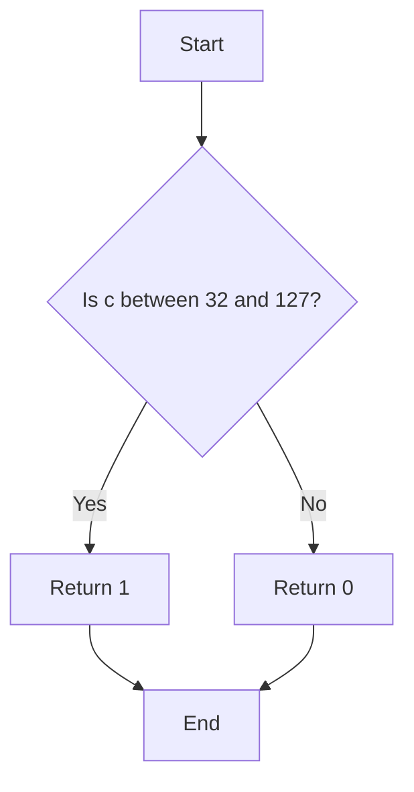
### toupper

If  c is a lowercase letter, toupper() returns its uppercase equivalent, if an uppercase representation exists in the current locale.  Otherwise, it returns c. 

`int ft_toupper(int c);`

The value returned is that of the converted letter, or c if the conversion was not possible.

```c
int	ft_toupper(int c)
{
	if (c >= 97 && c <= 122)
		c -= 32;
	return (c);
}
```
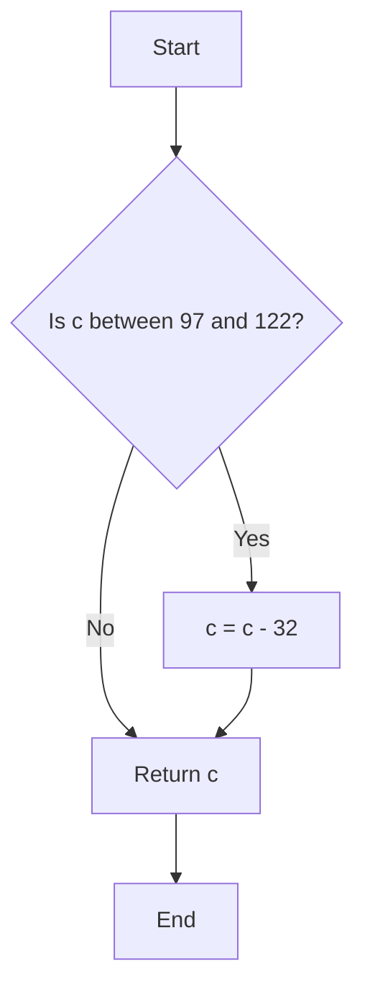
### tolower

If  c is an uppercase letter, tolower() returns its lowercase equivalent, if a lowercase representation exists in the current locale.  Otherwise, it returns c.

`int ft_tolower(int c);`

The value returned is that of the converted letter, or c if the conversion was not possible.

```c
int	ft_tolower(int c)
{
	if (c >= 65 && c <= 90)
		c += 32;
	return (c);
}
```
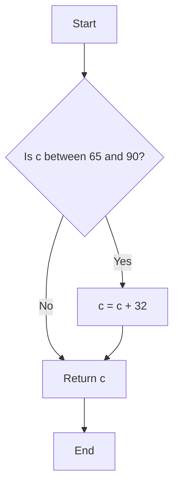
### strlen
**calculate the length of a string**

`size_t ft_strlen(const char *s);`

The strlen() function calculates the length of the string pointed to by s, excluding the terminating null byte ('\0').

```c
size_t	ft_strlen(const char *str)
{
	size_t	i;

	i = 0;
	if (!str)
		return (i);
	while (str[i] != '\0')
		i++;
	return (i);
}
```
This function ft_strlen calculates the length of a string by iterating through each character until it encounters the null terminator '\0', which marks the end of the string.

The `ft_strlen` function calculates the length of a string by iterating through each character until it encounters the null terminator `'\0'`, which signifies the end of the string.

**Step-by-Step Breakdown:**
1. **Initialization:** A variable `i` of type `size_t` is initialized to store the length of the string.
2. **Null Check:** The function checks if the input string `str` is `NULL`. If it is, the function returns 0.
3. **Iteration:** A `while` loop runs, continuing as long as the current character `str[i]` is not the null terminator `'\0'`.
4. **Increment:** Inside the loop, `i` is incremented to move to the next character.
5. **Completion:** When the loop encounters the null terminator, it exits.
6. **Return:** The function returns the value of `i`, which is the length of the string.

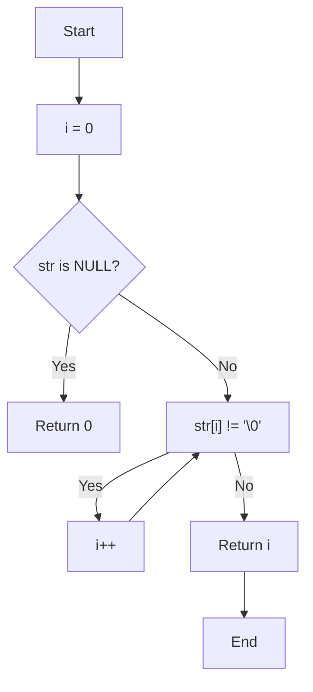
### strlcpy
### strlcat
### strchr
```c
#include "libft.h"

char	*ft_strchr(const char *s, int c)
{
	unsigned char	*str;
	unsigned char	uc;
	size_t			i;

	str = (unsigned char *)s;
	uc = (unsigned char)c;
	i = 0;
	while (str[i] != '\0')
	{
		if (str[i] == uc)
			return ((char *)&str[i]);
		i++;
	}
	if (uc == '\0')
		return ((char *)&str[i]);
	return (NULL);
}
```
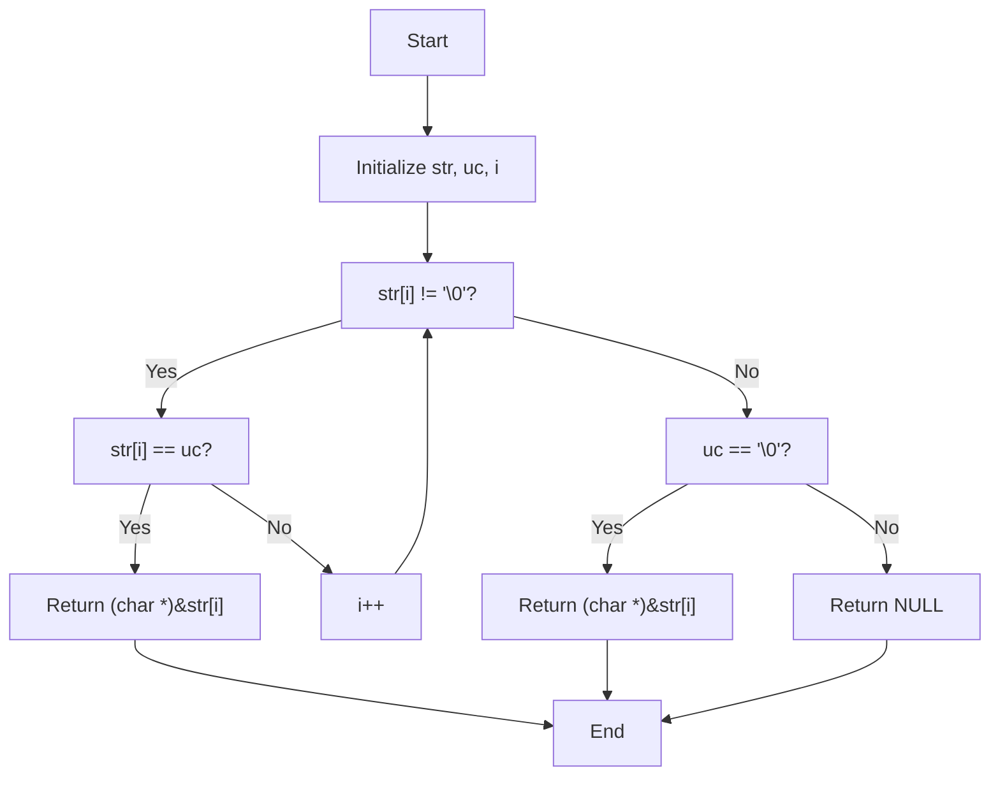
### strrchr
### strncmp

```c
int	ft_strncmp(const char *s1, const char *s2, size_t n)
{
	unsigned char	*str1;
	unsigned char	*str2;
	size_t			i;

	str1 = (unsigned char *)s1;
	str2 = (unsigned char *)s2;
	i = 0;
	if (n == 0)
		return (0);
	while (str1[i] != '\0' && str1[i] == str2[i] && i < n - 1)
		i++;
	return (str1[i] - str2[i]);
}
```
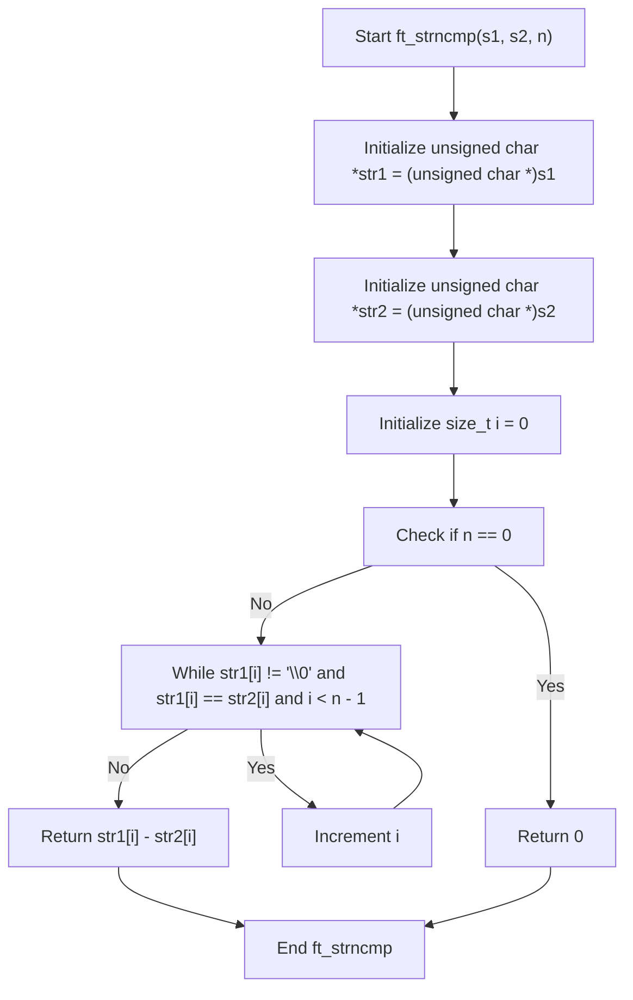
### strnstr

### memset
```c
void	*ft_memset(void *s, int c, size_t n)
{
	size_t	i;
	unsigned char		*p;

	i = 0;
	p = (unsigned char *)s;
	while (i < n)
	{
		p[i] = c;
		i++;
	}
	return (p);
}
```
#### The difference between unsigned char and char
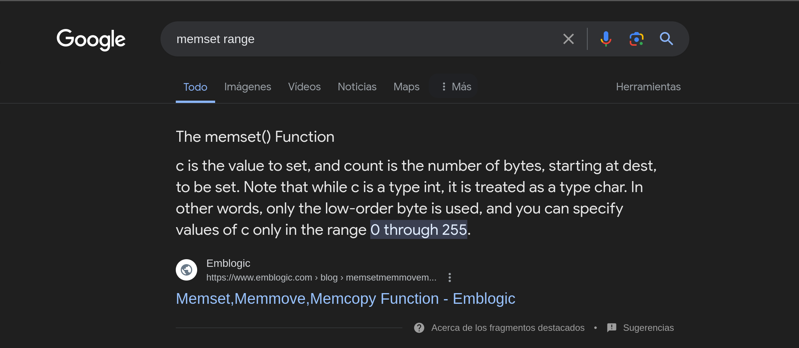
[Link to the first image](https://www.emblogic.com/blog/05/memsetmemmovememcopy-function/)

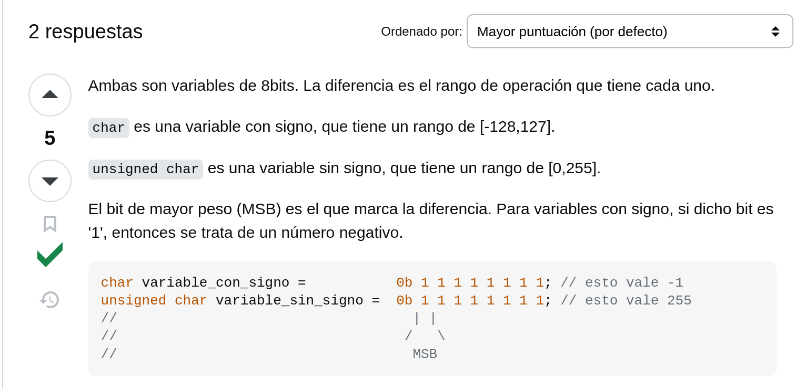
[Link to the second image](https://es.stackoverflow.com/questions/461245/cual-es-la-diferencia-entre-char-y-unsigned-char-en-c)
### bzero
```c
void	ft_bzero(void *s, size_t n)
{
	size_t	i;
	unsigned char	*p;

		
	i = 0;
	p = (unsigned char *)s;
	while (i < n)
	{
		p[i] = '\0';
		i++;
	}
}
```

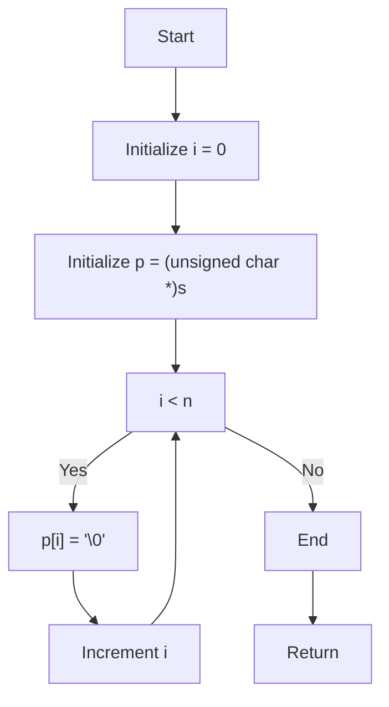
### memcpy
### memmove
### memchr
### memcmp
```c
int	ft_memcmp(const void *s1, const void *s2, size_t n)
{
	unsigned char	*str1;
	unsigned char	*str2;
	size_t			i;

	str1 = (unsigned char *)s1;
	str2 = (unsigned char *)s2;
	i = 0;
	while (i < n)
	{
		if (str1[i] != str2[i])
			return (str1[i] - str2[i]);
		i++;
	}
	return (0);
}
```
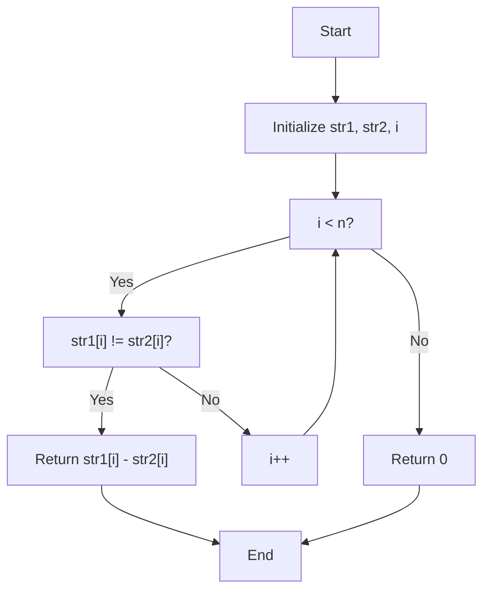
### atoi

```c
int	ft_atoi(const char *nptr)
{
	size_t	i;
	int		mult;
	int		res;

	i = 0;
	res = 0;
	mult = 1;
	while (nptr[i] == 32 || (nptr[i] >= 9 && nptr[i] <= 13))
		i++;
	if (nptr[i] == '-' || nptr[i] == '+')
	{
		if (nptr[i] == '-')
			mult *= -1;
	}
	while (nptr[i] >= 48 && nptr[i] <= 57)
	{
		res = res * 10 + (nptr[i] - 48);
		i++;
	}
	return (res * mult);
}
```
## strdup
## calloc
```c
#include "libft.h"

void	*ft_calloc(size_t nmemb, size_t size)
{
	void	*ptr;

	ptr = malloc(nmemb * size);
	if (!ptr)
		return (NULL);
	ft_bzero(ptr, size * nmemb);
	return (ptr);
}
```
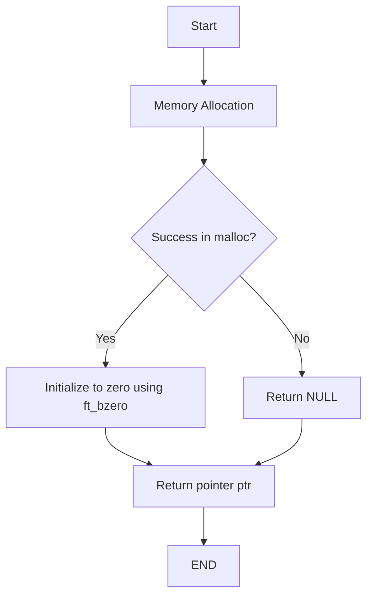
