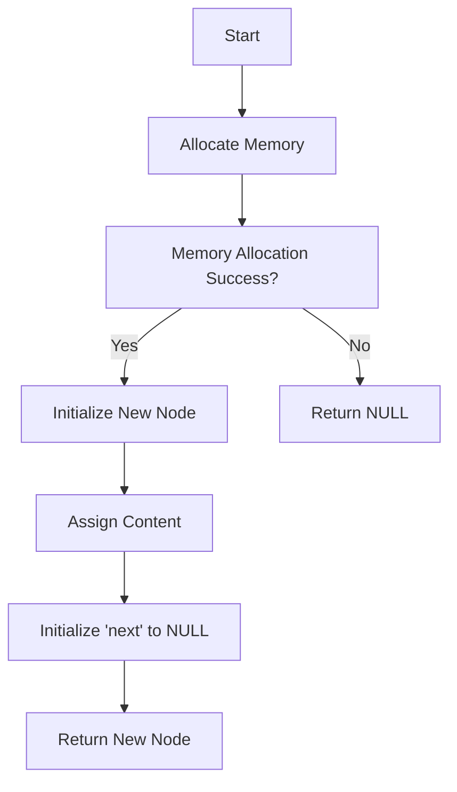
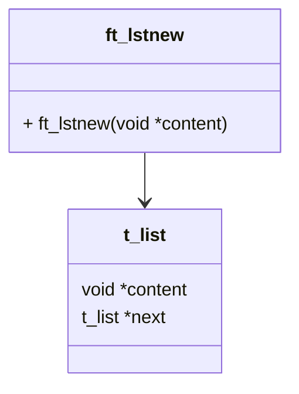

```mermaid
graph TD;
    A[Start] --> B[Allocate Memory];
    B --> C[Memory Allocation Success?];
    C -- Yes --> D[Initialize New Node];
    D --> E[Assign Content];
    E --> F[Initialize 'next' to NULL];
    F --> G[Return New Node];
    C -- No --> H[Return NULL];
```

```mermaid
classDiagram
    class t_list {
        void *content
        t_list *next
    }

    class ft_lstnew {
        + ft_lstnew(void *content)
    }

    ft_lstnew --> t_list
```
