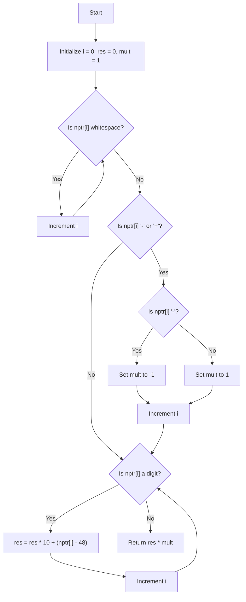

```c
#include "libft.h"
#include <stdlib.h>

void	ft_putchar(char c)
{
	write(1, &c, 1);
}

void	ft_putstr(char *str)
{
	int	i;

	i = 0;
	while (str[i] != '\0')
	{
		ft_putchar(str[i]);
		i++;
	}
}

int	ft_atoi(const char *nptr)
{
	size_t	i;
	int		mult;
	int		res;

	i = 0;
	res = 0;
	mult = 1;
	while (nptr[i] == 32 || (nptr[i] >= 9 && nptr[i] <= 13))
		i++;
	if (nptr[i] == '-' || nptr[i] == '+')
	{
		if (nptr[i] == '-')
			mult *= -1;
	}
	while (nptr[i] >= 48 && nptr[i] <= 57)
	{
		res = res * 10 + (nptr[i] - 48);
		i++;
	}
	return (res * mult);
}

void	ft_putnbr(int nb)
{
	if (nb < 0)
	{
		ft_putchar('-');
		nb = -nb;
	}
	if (nb > 10)
	{
		ft_putnbr(nb / 10);
		nb = nb % 10;
	}
	if (nb < 10)
		ft_putchar(nb + 48);
}

int	main(int argc, char *argv[])
{
	if (argc != 2)
	{
		ft_putstr(argv[0]);
		ft_putstr(" <number>\n");
		return (1);
	}
	ft_putstr("My Atoi: ");
	ft_putnbr(ft_atoi(argv[1]));
	ft_putchar('\n');
	ft_putstr("The original Atoi: ");
	ft_putnbr(atoi(argv[1]));
	ft_putchar('\n');
	return (0);
}
```
```c
#include "libft.h"
#include <stdlib.h>

void	ft_putchar(char c)
{
	write(1, &c, 1);
}

void	ft_putstr(char *str)
{
	int	i;

	i = 0;
	while (str[i] != '\0')
	{
		ft_putchar(str[i]);
		i++;
	}
}

int	ft_atoi(const char *nptr)
{
	size_t	i;
	int		mult;
	int		res;

	i = 0;
	res = 0;
	mult = 1;
	while (nptr[i] == 32 || (nptr[i] >= 9 && nptr[i] <= 13))
		i++;
	if (nptr[i] == '-' || nptr[i] == '+')
	{
		if (nptr[i] == '-')
			mult *= -1;
	}
	while (nptr[i] >= 48 && nptr[i] <= 56)
	{
		res = res * 10 + (nptr[i] - 48);
		i++;
	}
	return (res * mult);
}

void	ft_putnbr(int nb)
{
	if (nb < 0)
	{
		ft_putchar('-');
		nb = -nb;
	}
	if (nb > 10)
	{
		ft_putnbr(nb / 10);
		nb = nb % 10;
	}
	if (nb < 10)
		ft_putchar(nb + 48);
}

int	main(int argc, char *argv[])
{
	if (argc != 2)
	{
		ft_putstr(argv[0]);
		ft_putstr(" <number>\n");
		return (1);
	}
	ft_putstr("My Atoi: ");
	ft_putnbr(ft_atoi(argv[1]));
	ft_putchar('\n');
	ft_putstr("The original Atoi: ");
	ft_putnbr(atoi(argv[1]));
	ft_putchar('\n');
	return (0);
}
```


```c
#include <unistd.h>

#include <stdlib.h>
void	ft_putchar(char c)
{
	write(1, &c, 1);
}

void	ft_putstr(char *str)
{
	int	i;

	i = 0;
	while (str[i] != '\0')
	{
		ft_putchar(str[i]);
		i++;
	}
}


static int	ft_isspace(char c)
{
	return (c == ' ' || c == '\f' || c == '\n' || c == '\r'
		|| c == '\t' || c == '\v');
}

int	ft_atoi(const char *nptr)
{
	size_t	i;
	int		sign;
	int		res;

	i = 0;
	res = 0;
	sign = 1;
	while (ft_isspace(nptr[i]))
		++i;
	if (nptr[i] == '-' || nptr[i] == '+')
	{
		if (nptr[i] == '-')
			sign = -1;
		i++;
	}
	while ('0' <= nptr[i] && nptr[i] <= '9')
	{
		res = res * 10 + (nptr[i] - '0');
		++i;
	}
	return (sign * res);
}

void	ft_putnbr(int nb)
{
	if (nb < 0)
	{
		ft_putchar('-');
		nb = -nb;
	}
	if (nb > 10)
	{
		ft_putnbr(nb / 10);
		nb = nb % 10;
	}
	if (nb < 10)
		ft_putchar(nb + 48);
}


int	main(int argc, char *argv[])
{
	if (argc != 2)
	{
		ft_putstr(argv[0]);
		ft_putstr(" <character>\n");
		return (1);
	}
	int	value = ft_atoi(argv[1]);
	ft_putstr("Original atoi: ");
	ft_putnbr(value);
	ft_putchar('\n');
	int another_value = atoi(argv[1]);
	ft_putstr("Another atoi: ");
	ft_putnbr(another_value);
	return (0);
}
```


