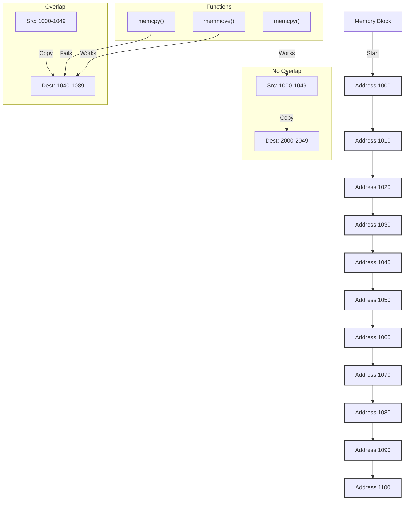

### Memory and Copy Functions

1. **Memory**:
   - The computer's memory is like a series of consecutive slots, each with a unique address.
   - Imagine each slot as a memory address where you can store data.

2. **Memory Copy Functions**:
   - `memcpy(dest, src, n)`: Copies `n` bytes from the `src` address to the `dest` address.
   - `memmove(dest, src, n)`: Does the same as `memcpy()`, but correctly handles cases where `src` and `dest` overlap.

### Memory Overlap

- **No overlap**:
  - `src` and `dest` are in different parts of the memory. For example:
    - `src`: Addresses 1000 to 1049
    - `dest`: Addresses 2000 to 2049
  - In this case, `memcpy()` works fine.

- **With overlap**:
  - Part of `src` and `dest` occupy the same memory addresses. For example:
    - `src`: Addresses 1000 to 1049
    - `dest`: Addresses 1040 to 1089
  - Here, `memcpy()` can copy data incorrectly because it overwrites data in `src` while copying.

### Rules

- **Use `memcpy()`**:
  - When you are sure that `src` and `dest` do not overlap in memory.
  - Example: Copying from addresses 1000-1049 to 2000-2049.

- **Use `memmove()`**:
  - When `src` and `dest` might be in the same memory area or you are not sure.
  - Example: Copying from addresses 1000-1049 to 1040-1089.

### Summary
- **General rule**: Use `memcpy()` only if `src` and `dest` are in separate memory areas. If they might overlap, use `memmove()`.

