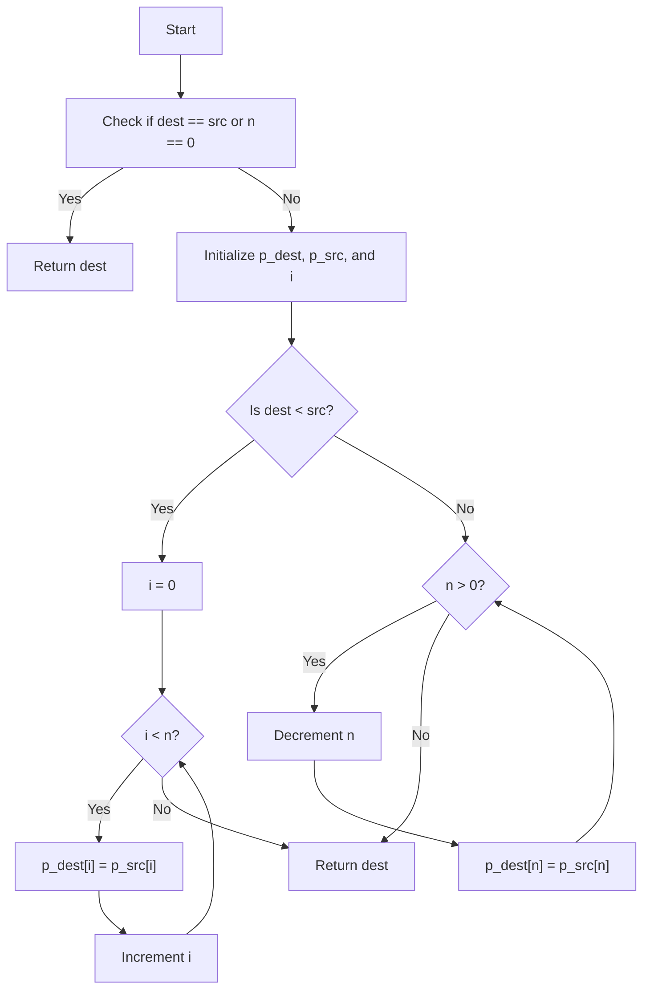

```mermaid
flowchart TD
    A["Start"] --> B["Check if dest == src or n == 0"]
    B -->|Yes| C["Return dest"]
    B -->|No| D["Initialize p_dest, p_src, and i"]
    D --> E{"Is dest < src?"}
    E -->|Yes| F["i = 0"]
    F --> G{"i < n?"}
    G -->|Yes| H["p_dest[i] = p_src[i]"]
    H --> I["Increment i"]
    I --> G
    G -->|No| J["Return dest"]
    E -->|No| K{"n > 0?"}
    K -->|Yes| L["Decrement n"]
    L --> M["p_dest[n] = p_src[n]"]
    M --> K
    K -->|No| J
```
