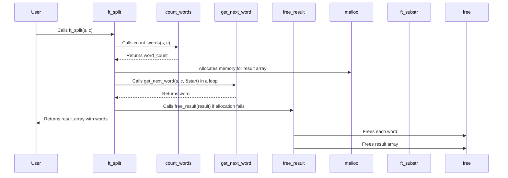

```c
#include "libft.h"

/*
 * ft_array_len: Calculates how many substrings will be generated by splitting 
 * s by c.
 * ft_next_string: Finds the next substring within s starting from *start, 
 * using c as a delimiter.
 * ft_free_memory: Frees dynamically allocated memory for an array 
 * of pointers to strings.
 * ft_split: Splits the string s into substrings using c as a delimiter 
 * and returns an array of pointers to these substrings.
*/

static size_t	ft_array_len(char const *s, char c)
{
	size_t	i;
	size_t	total;

	i = 0;
	total = 0;
	while (s[i] != '\0')
	{
		if (s[i] != c)
		{
			total++;
			while (s[i] != '\0' && s[i] != c)
				i++;
		}
		else
			i++;
	}
	return (total);
}

static	char	*ft_next_string(const char *s, char c, size_t *start)
{
	size_t	i;
	char	*str;

	i = *start;
	while (s[i] != '\0' && s[i] == c)
		i++;
	*start = i;
	while (s[i] != '\0' && s[i] != c)
		i++;
	str = ft_substr(s, *start, i - *start);
	*start = i;
	return (str);
}

static	void	ft_free_memory(char **str)
{
	size_t	i;

	i = 0;
	while (str[i])
		free(str[i++]);
	free(str);
}

char	**ft_split(char const *s, char c)
{
	char	**result;
	size_t	strcount;
	size_t	i;
	size_t	start;

	if (!s)
		return (NULL);
	strcount = ft_array_len(s, c);
	result = (char **)ft_calloc(strcount + 1, sizeof(char *));
	if (!result)
		return (NULL);
	i = 0;
	start = 0;
	while (i < strcount)
	{
		result[i] = ft_next_string(s, c, &start);
		if (!result[i])
			ft_free_memory(result);
		i++;
	}
	return (result);
}
```


