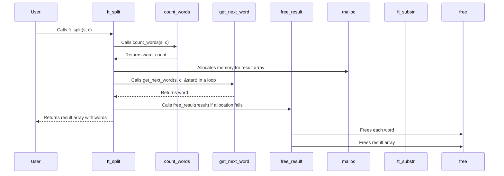

```mermaid
sequenceDiagram
    participant User
    participant ft_split
    participant count_words
    participant get_next_word
    participant free_result
    participant malloc
    participant ft_substr
    participant free

    User->>ft_split: Calls ft_split(s, c)
    ft_split->>count_words: Calls count_words(s, c)
    count_words-->>ft_split: Returns word_count
    ft_split->>malloc: Allocates memory for result array
    ft_split->>get_next_word: Calls get_next_word(s, c, &start) in a loop
    get_next_word-->>ft_split: Returns word
    ft_split->>free_result: Calls free_result(result) if allocation fails
    ft_split-->>User: Returns result array with words
    free_result->>free: Frees each word
    free_result->>free: Frees result array
```
