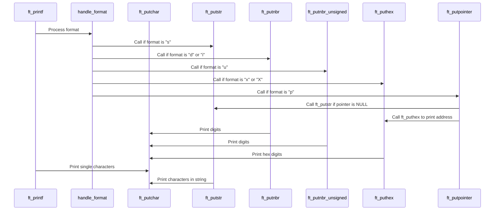
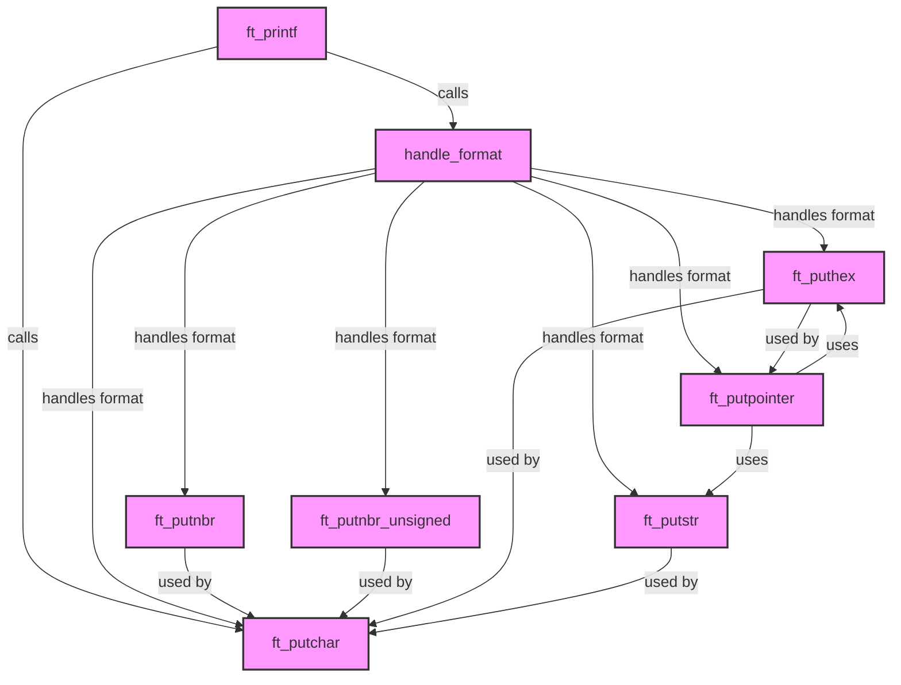

First day: Tuesday Jul 16 21:17

> [!CAUTION]  
> These functions have not been verified yet. **_I cannot demonstrate that they work correctly._**

### Simplified Guide for Reprogramming `printf()` using `libft`

To reprogram `printf()` with `libft`, follow these streamlined steps:

### 1. **Variadic Functions**
   - **Concept**: Learn about variadic functions using `stdarg.h`.
   - **Key Macros**: Understand `va_start`, `va_arg`, `va_end`.

### 2. **Reuse `libft` Functions**
   - **String Functions**: Use `ft_strlen`, `ft_strjoin`, `ft_strdup`.
   - **Conversion Functions**: Use `ft_itoa` for integers.
   - **Output Functions**: Use `ft_putchar_fd`, `ft_putstr_fd`.

### 3. **Handle Format Specifiers**
   - **Common Specifiers**: `%c`, `%s`, `%d`, `%i`, `%u`, `%x`, `%X`, `%p`.
   - **Incremental Approach**: Implement and test one specifier at a time.

### 4. **Core Function Development**
   - **Initialization**: Set up variadic list.
   - **Parsing**: Identify and process format specifiers.
   - **Formatting**: Convert arguments based on specifiers.
   - **Output**: Print formatted strings using `libft` functions.

### 5. **Testing**
   - **Unit Tests**: Write tests for each format specifier.
   - **Edge Cases**: Consider special characters, large numbers, and null pointers.

### 6. **Makefile**
   - **Integration**: Ensure the Makefile compiles all necessary files.
   - **Targets**: Use `all`, `clean`, `fclean`, `re` for build management.

By focusing on these key areas, you can efficiently reprogram `printf()` using your existing `libft` functions.

